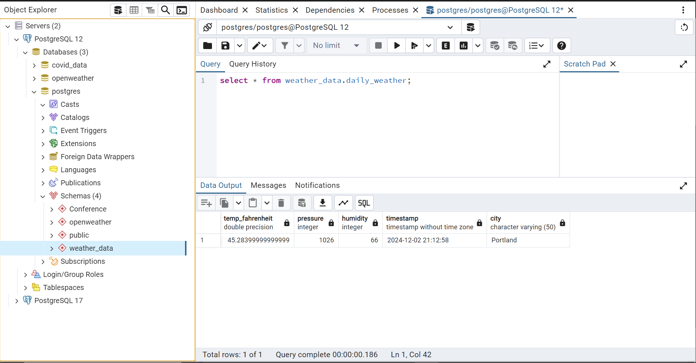

# WEATHER DATA PIPELINE WITH APACHE AIRFLOW

## Description
This project demonstrates an ETL pipeline built using **Apache Airflow** to extract weather data from the OpenWeather API, transform it, and load it into a **PostgreSQL** database. The pipeline ensures modularity and reliability by performing the following tasks:
1. **API Readiness Check**: Confirms API availability.
2. **Data Extraction**: Fetches weather data from the OpenWeather API for a given city(**Portland**).
3. **Data Transformation**: Converts raw API data (e.g., temperature in Kelvin) into a usable format.
4. **Data Loading**: Inserts transformed data into a local PostgreSQL database with an appropriate schema.


### 1. Airflow DAG
The Airflow DAG implements the following tasks:
- **API Readiness Check**: Uses an `HttpSensor` to check the availability of the OpenWeather API.
- **Extract Weather Data**: Uses a PythonOperator to fetch weather data via the openweather API.
- **Transform Weather Data**: Transforms API responses (e.g., temperature conversion) and prepares data for insertion.
- **Load Weather Data**: Inserts transformed data into a PostgreSQL table with a well-defined schema.

#### Code:
Find the Airflow DAG code [here](Airflow-lab/dags/weather_pipe.py).

### 2. Database Schema
The PostgreSQL schema is defined as follows:
- **Schema**: `weather_data`
- **Table**: `daily_weather`
- **Columns**:
  - `temp_fahrenheit`: `FLOAT`
  - `pressure`: `INT`
  - `humidity`: `INT`
  - `timestamp`: `TIMESTAMP`
  - `city`: `VARCHAR(255)`

#### Schema Creation Snippet:
```sql
CREATE SCHEMA IF NOT EXISTS weather_data;

CREATE TABLE IF NOT EXISTS weather_data.daily_weather (
    temp_fahrenheit FLOAT,
    pressure INT,
    humidity INT,
    timestamp TIMESTAMP,
    city VARCHAR(50)
);
```

### 3. Database Image
- Screenshot of records in the database.

**Example Screenshot (Data Record):**


### 4. Airflow Logs
screenshots of DAG performance and logs.

**Example Screenshot (DAG Overview):**


**Example Screenshot (Logs):**
- Logs for checking API readiness.


- Logs for fetching the data


- Logs for transforming the data


- Logs for loading the data

- The log output from the Airflow task provides detailed information about the execution of the load_weather_data task in the weather data pipeline.

### 5. Architecture Diagram
A visual representation of the architecture implemented in this project.


**Diagram Description:**
- **Input Source**: OpenWeather API.
- **ETL Workflow**: Managed by Airflow.
- **Database**: PostgreSQL for storing transformed weather data.

**Example Diagram:**


